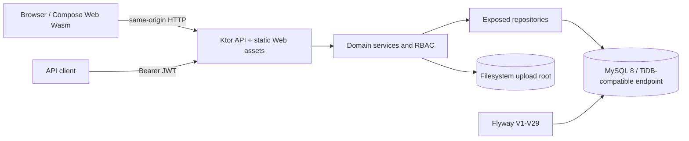

# OMS Phase 1 Architecture

## Runtime view

The production package is one Ktor process: it serves the compiled Compose Web distribution at `/` and JSON/file endpoints under `/api/v1`. The same-origin layout avoids production CORS unless a frontend is deployed separately.

## Source modules

- `composeApp` contains the Web UI, navigation, localization, API client and browser session integration. Wasm is the production Web target; the JS target is development compatibility.
- `server` contains Ktor routing, DTOs, services, repositories, Exposed table mappings, Flyway resources, security and local upload storage.
- `shared` is a small KMP library compiled for JVM, JS and Wasm. It is the extension point for future cross-platform domain code.

No Android or iOS application target is included in Phase 1. Mobile UI, offline synchronization and store signing are Phase 2 boundaries.

## Security and main flows

Login validates an Active user and creates an HTTP-only `oms_session` cookie; the response also carries a short-lived JWT for API clients. Every protected request re-resolves current user status and role. `401` means missing/invalid/inactive authentication; `403` means an authenticated role or PM project scope is insufficient.

Project managers are limited to projects assigned through `projects.manager_id`. Admin is unrestricted. Inspector can create and edit inspection/SIR content but cannot review it. Viewer and Guest are read-only. User Administration is Admin-only.

Inspection/SIR state is `DRAFT -> PENDING_REVIEW -> COMPLETED`; a review rejection returns the report to `DRAFT` with a reason. Financial entries and XLS/XLSX import/export are limited to Admin and Project Manager. Documents and photos store metadata in MySQL and bytes under `OMS_UPLOAD_DIR`.

## Deployment

Docker Compose runs MySQL and the integrated OMS image, with health-gated startup and separate persistent volumes for database and uploads. Flyway runs before repositories are used. Runtime secrets are environment values. Production TLS/reverse proxy and external backup scheduling are infrastructure responsibilities documented in the D11 report.

