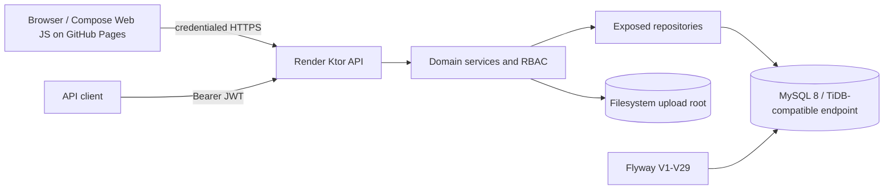

# OMS Phase 1 Architecture

## Runtime view

The production browser bundle is published by GitHub Pages at `https://karatanov.github.io/oms/`. Render runs the Ktor JSON/file API at `https://oms-3j46.onrender.com/api/v1`; it allows the GitHub Pages origin with credentials for cookie-backed sessions. The Render root redirects legacy bookmarks to the Pages UI.

## Source modules

- `composeApp` contains the Web UI, navigation, localization, API client and browser session integration. Wasm is the production Web target; the JS target is development compatibility.
- `server` contains Ktor routing, DTOs, services, repositories, Exposed table mappings, Flyway resources, security and local upload storage.
- `shared` is a small KMP library compiled for JVM, JS and Wasm. It is the extension point for future cross-platform domain code.

No Android or iOS application target is included in Phase 1. Mobile UI, offline synchronization and store signing are Phase 2 boundaries.

## Security and main flows

Login validates an Active user and creates an HTTP-only `oms_session` cookie; the response also carries a short-lived JWT for API clients. Every protected request re-resolves current user status and role. `401` means missing/invalid/inactive authentication; `403` means an authenticated role or PM project scope is insufficient.

Project managers are limited to projects assigned through `projects.manager_id`. Admin is unrestricted. Inspector can create and edit inspection/SIR content but cannot review it. Viewer is an authenticated read-only database role. Guest is an anonymous browser-session mode, not a database role or user account: it can access only the public map, project registry and general project information. User Administration is Admin-only.

Inspection/SIR state is `DRAFT -> PENDING_REVIEW -> COMPLETED`; a review rejection returns the report to `DRAFT` with a reason. Financial entries and XLS/XLSX import/export are limited to Admin and Project Manager. Documents and photos store metadata in MySQL and bytes under `OMS_UPLOAD_DIR`.

The current operational hierarchy is `Ukraine Recovery Programme III -> Tranche A operational subprojects + 177 Tranche B screening subprojects -> subproject parts where a source code is a lot`. Programme agreement facts are separated into `programme_details`; source monitoring and bilingual identifiers are separated into `project_monitoring_details`; exact money continues to use `project_amounts`; procurement records reference the owning OMS subproject. This keeps project CRUD and third-level hierarchy support intact while avoiding fabricated business values. Geocoding is auditable: confirmed addresses use address coordinates, otherwise the agreed map fallback is the corresponding regional centre; accuracy/query/provider data is retained separately from the project name.

The import is deterministic rather than an administrator click-flow. `tools/generate_urp3_seed.py` reads the authoritative monitoring workbook plus the supplementary Tranche A+B workbook, merges only confirmed duplicate lot identifiers, and generates reviewed JSON/SQL artifacts consumed by Flyway V38. `tools/generate_urp3_screening_tranche_b.py` independently processes the approved `XX09_NN` Tranche B screening rows and emits the immutable V54 addition; it never rebuilds or deletes operational data. `tools/generate_tranche_b_procurement_backfill.py` processes the Tranche B procurement-plan sheet and emits V55 plus a reviewed JSON snapshot; V55 fills only missing values and relations, preserving non-empty OMS values. Future source refreshes should reuse the relevant generator and review its provenance/merge report before producing a new forward-only migration.

## Deployment

Docker Compose runs MySQL and the integrated OMS image, with health-gated startup and separate persistent volumes for database and uploads. Flyway runs before repositories are used. Runtime secrets are environment values. Production TLS/reverse proxy and external backup scheduling are infrastructure responsibilities documented in the D11 report.
