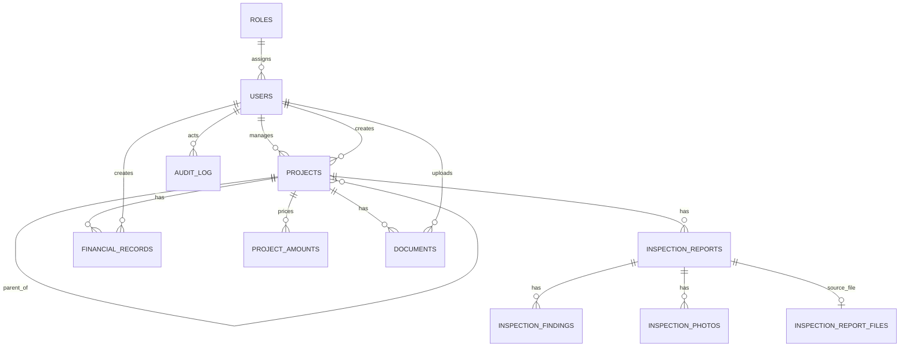

# Database and Migration Reference

OMS uses MySQL 8 and Flyway. The canonical source is `server/src/main/resources/db/migration`; Exposed table mappings mirror the current schema. Migrations V1-V38 run automatically at startup in version order.

## URP III operational dataset

Migration V38 replaces disposable operational records with the authoritative **Ukraine Recovery Programme III** hierarchy while preserving users, password hashes, roles and login-related state. The result is one programme and 134 subprojects derived from 136 physical rows in `DB_Monitoring table.xlsx`; duplicate source rows `SM08_09` and `KH08_07#Lot6` are merged by their stable lot identifiers. No subproject parts, inspections, transactional financial records or uploaded documents are fabricated.

`programme_details` stores the programme implementor, EIB finance contract 97043, Serapis 2023-0227, agreement date, EUR 100 million loan and source provenance. `project_monitoring_details` stores source identifiers and bilingual monitoring metadata without turning spreadsheet-specific attributes into unrelated project columns. Procurement rows are linked to their OMS subprojects and retain source-backed planned tender dates, method, document type and comments. Exact monetary snapshots remain in `project_amounts` with source currency, EUR/UAH conversion, rate and rate date.

The deterministic generator is `tools/generate_urp3_seed.py`; its canonical UTF-8 JSON and generated SQL live under `server/src/main/resources/db/seed`. Re-running it against the two authoritative workbooks must produce the same project UUIDs and row mapping. The one-time cached geocoder follows the OpenStreetMap Nominatim usage policy. One address match is retained; where an address cannot be confirmed, the agreed fallback is the relevant regional centre (133 records). `project_monitoring_details.geocode_accuracy` distinguishes `address` from the legacy storage value `oblast_center`, and the query/display match is retained for audit and later refinement.

Migration V34 adds the designer name, design-contract number/term and construction-contract number to `projects`. Exact monetary entry is stored in `project_amounts`, one row per project and amount kind (`budget`, `engineer`, `supervision`, `construction`). It preserves `DECIMAL(18,2)` source/equivalent values, EUR/UAH currency, `DECIMAL(18,8)` UAH-per-EUR rate, effective date and whether the user edited the conversion. Existing whole-UAH project columns remain compatibility projections for current totals and charts; they are derived from the snapshots on save. The unique `(project_id, amount_kind)` key prevents duplicates and the project foreign key cascades deletion.

Migration V35 adds `design_start_date` and `design_planned_end_date` to `projects`. The design duration is derived from these two dates in whole calendar days; it is never entered manually. The compatibility `design_contract_term` value is refreshed from this calculation when both dates are present.

Migration V36 adds the two full contract-information groups to `projects`: technical supervision and engineer-consultant. Each group has the organisation name, contract number/date, start date and planned end date. Durations are calculated from the latter two dates in the API and are not persisted as editable values.

Core entities are roles/users, hierarchical projects, inspection reports/findings/photos/source files, financial records, project documents, procurement reference records and audit events. Inspection reports retain their SIR code, type (`planned`, `unplanned`, `final`) and optional latitude/longitude alongside the workflow fields. UUID columns are unique public identifiers; numeric IDs remain internal foreign keys. Foreign keys use restrictive deletion for business records and cascade only where a child file/finding cannot exist without its parent.

Important indexes include unique user username/email/UUID, project UUID, inspection/document/photo/financial UUIDs, activation-token hash, and foreign-key indexes created by migrations. Consult the SQL migration when changing constraints; table mappings alone are not a migration mechanism.

## Operations

- Empty database: create the database/user, start OMS, and wait for Flyway V1-V36 plus `/health`.
- Upgrade: back up MySQL and uploads, deploy the new application, and let Flyway apply only pending versions. Never edit an applied migration.
- V38 is an intentional operational-data boundary: take a backup before deployment. It deletes project-linked operational data, but not users, credentials, roles or authentication state, then loads the canonical URP III dataset.
- V27 intentionally replaces disposable operational/demo data with the TVET II reference hierarchy while retaining procurement reference data; review this boundary for older installations.
- Schema downgrade is not supported. Recovery is restore of the pre-release database and matching upload backup, followed by the previous application image.
- TiDB mode uses generated copies of the MySQL migrations with unsupported `AFTER column` clauses removed; set `DATABASE_DIALECT=tidb` only for that compatible target.
