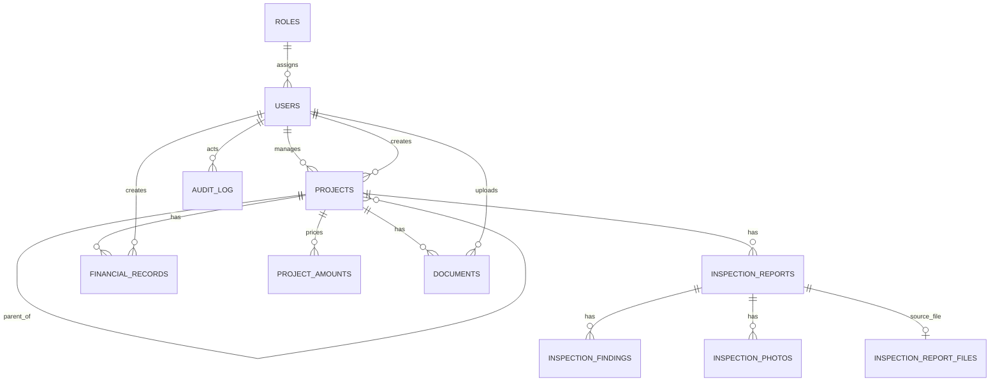

# Database and Migration Reference

OMS uses MySQL 8 and Flyway. The canonical source is `server/src/main/resources/db/migration`; Exposed table mappings mirror the current schema. Migrations V1-V34 run automatically at startup in version order.

Migration V34 adds the designer name, design-contract number/term and construction-contract number to `projects`. Exact monetary entry is stored in `project_amounts`, one row per project and amount kind (`budget`, `engineer`, `supervision`, `construction`). It preserves `DECIMAL(18,2)` source/equivalent values, EUR/UAH currency, `DECIMAL(18,8)` UAH-per-EUR rate, effective date and whether the user edited the conversion. Existing whole-UAH project columns remain compatibility projections for current totals and charts; they are derived from the snapshots on save. The unique `(project_id, amount_kind)` key prevents duplicates and the project foreign key cascades deletion.

Core entities are roles/users, hierarchical projects, inspection reports/findings/photos/source files, financial records, project documents, procurement reference records and audit events. Inspection reports retain their SIR code, type (`planned`, `unplanned`, `final`) and optional latitude/longitude alongside the workflow fields. UUID columns are unique public identifiers; numeric IDs remain internal foreign keys. Foreign keys use restrictive deletion for business records and cascade only where a child file/finding cannot exist without its parent.

Important indexes include unique user username/email/UUID, project UUID, inspection/document/photo/financial UUIDs, activation-token hash, and foreign-key indexes created by migrations. Consult the SQL migration when changing constraints; table mappings alone are not a migration mechanism.

## Operations

- Empty database: create the database/user, start OMS, and wait for Flyway V1-V34 plus `/health`.
- Upgrade: back up MySQL and uploads, deploy the new application, and let Flyway apply only pending versions. Never edit an applied migration.
- V27 intentionally replaces disposable operational/demo data with the TVET II reference hierarchy while retaining procurement reference data; review this boundary for older installations.
- Schema downgrade is not supported. Recovery is restore of the pre-release database and matching upload backup, followed by the previous application image.
- TiDB mode uses generated copies of the MySQL migrations with unsupported `AFTER column` clauses removed; set `DATABASE_DIALECT=tidb` only for that compatible target.
