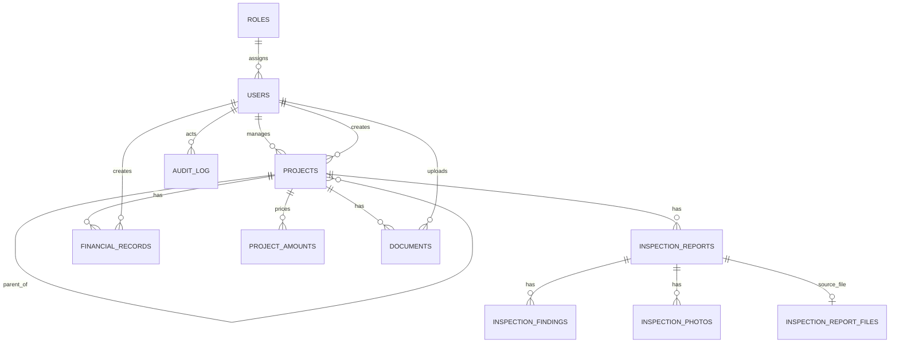

# Database and Migration Reference

OMS uses MySQL 8 and Flyway. The canonical source is `server/src/main/resources/db/migration`; Exposed table mappings mirror the current schema. Migrations run automatically at startup in version order.

## URP III operational dataset

Migration V38 replaces disposable operational records with the authoritative **Ukraine Recovery Programme III** hierarchy while preserving users, password hashes, roles and login-related state. The result is one programme and 134 imported project records derived from 136 physical rows in `DB_Monitoring table.xlsx`; duplicate source rows `SM08_09` and `KH08_07#Lot6` are merged by their stable lot identifiers. Inspections, transactional financial records and uploaded documents are not fabricated. V53 subsequently classifies imported `#Lot` records into the correct subproject-part hierarchy.

`programme_details` stores the programme implementor, EIB finance contract 97043, Serapis 2023-0227, agreement date, EUR 100 million loan and source provenance. `project_monitoring_details` stores source identifiers and bilingual monitoring metadata without turning spreadsheet-specific attributes into unrelated project columns. Procurement rows are linked to their OMS subprojects and retain source-backed planned tender dates, method, document type and comments. Exact monetary snapshots remain in `project_amounts` with source currency, EUR/UAH conversion, rate and rate date.

The deterministic generator is `tools/generate_urp3_seed.py`; its canonical UTF-8 JSON and generated SQL live under `server/src/main/resources/db/seed`. Re-running it against the two authoritative workbooks must produce the same project UUIDs and row mapping. The one-time cached geocoder follows the OpenStreetMap Nominatim usage policy. One address match is retained; where an address cannot be confirmed, the agreed fallback is the relevant regional centre (133 records). `project_monitoring_details.geocode_accuracy` distinguishes `address` from the legacy storage value `oblast_center`, and the query/display match is retained for audit and later refinement.

Migration V34 adds the designer name, design-contract number/term and construction-contract number to `projects`. Exact monetary entry is stored in `project_amounts`, one row per project and amount kind (`budget`, `engineer`, `supervision`, `construction`). It preserves `DECIMAL(18,2)` source/equivalent values, EUR/UAH currency, `DECIMAL(18,8)` UAH-per-EUR rate, effective date and whether the user edited the conversion. Existing whole-UAH project columns remain compatibility projections for current totals and charts; they are derived from the snapshots on save. The unique `(project_id, amount_kind)` key prevents duplicates and the project foreign key cascades deletion.

Migration V35 adds `design_start_date` and `design_planned_end_date` to `projects`. The design duration is derived from these two dates and is never entered manually. Internal API compatibility values retain days, while the UI presents the calculated duration in rounded months. The compatibility `design_contract_term` value is refreshed from this calculation when both dates are present.

Migration V36 adds the two full contract-information groups to `projects`: technical supervision and engineer-consultant. Each group has the organisation name, contract number/date, start date and planned end date. Durations are calculated from the latter two dates in the API and are not persisted as editable values.

Migration V42 changes `financial_records.amount` to `DECIMAL(18,2)`. Financial invoices, acts, payments and advances preserve the exact amount in their selected currency, including cents; API clients may submit a JSON decimal number with no more than two fractional digits. The frozen `amount_eur_cents` field remains the deterministic EUR equivalent used by charts.

Migration V51 simplifies `procurement_records` to one authoritative subproject code. The former import-only duplicates `sp_id`, `source_type` and `procurement_id` are removed from the physical schema; a selected subproject part is retained as `sub_project_lot_id`. Region, tranche and project relation are derived from the selected OMS subproject rather than trusted from a write request. Existing `prozorro_tender_id` URLs are retained, while legacy tender numbers are normalized to the canonical PROZORRO tender URL. The migration also clears the documents table and its durable mirrors: financial records remain ledger entries and are never regenerated as document records. V52 removes `record_number`, which was only the ordinal position in an imported spreadsheet; the internal primary key is retained without being exposed to users.

Migration V53 classifies every OMS project code containing `#Lot` as a `subproject_part`. It creates a missing parent subproject from the base code when needed, keeps the original row and its linked reports, payments, photos and monitoring data intact, and corrects procurement relations to store the parent code in `sub_project_id` and the full lot code in `sub_project_lot_id`. A lot budget is not copied to the newly created parent, preventing double counting in totals and charts.

Migration V54 adds **177 Tranche B** subprojects from `DB_Screening results.xlsx`, under the existing `Ukraine Recovery Programme III` parent. Only source identifiers formatted `XX09_NN` are imported; the three `0_REL` reference rows are explicitly excluded. Each imported subproject keeps its Ukrainian and English title, municipality/settlement and priority-area metadata, the source UAH and EUR budget snapshot, source-row provenance and screening submission state. It does not overwrite an already existing subproject code. The source workbook is represented by the reviewed UTF-8 snapshot `urp3_screening_tranche_b.json`; `tools/generate_urp3_screening_tranche_b.py` produces that snapshot and the forward-only migration. The 22 represented regions use the agreed regional-centre map fallback and each record is marked `oblast_center` in monitoring metadata until an exact address geocode is available.

Migration V55 reconciles procurement data with the **Tranche B** sheet of `Tranche A + B selected (2).xlsx`. It covers 53 source rows for 26 subprojects (26 works contracts, 26 technical-supervision contracts and one engineer-consultant contract). A record is matched by the stable subproject code plus source contract type. The migration restores missing project relations and missing source values only; non-empty OMS values, including administrator edits, are never overwritten. The reviewed `tranche_b_procurement_backfill.json` snapshot and `tools/generate_tranche_b_procurement_backfill.py` make this forward-only repair reproducible without accessing a local Excel path at runtime.

Core entities are roles/users, hierarchical projects, inspection reports/findings/photos/source files, financial records, project documents, procurement reference records and audit events. Inspection reports retain their SIR code, type (`planned`, `unplanned`, `final`) and optional latitude/longitude alongside the workflow fields. UUID columns are unique public identifiers; numeric IDs remain internal foreign keys. Foreign keys use restrictive deletion for business records and cascade only where a child file/finding cannot exist without its parent.

Important indexes include unique user username/email/UUID, project UUID, inspection/document/photo/financial UUIDs, activation-token hash, and foreign-key indexes created by migrations. Consult the SQL migration when changing constraints; table mappings alone are not a migration mechanism.

## Operations

- Empty database: create the database/user, start OMS, and wait for Flyway V1-V36 plus `/health`.
- Upgrade: back up MySQL and uploads, deploy the new application, and let Flyway apply only pending versions. Never edit an applied migration.
- V38 is an intentional operational-data boundary: take a backup before deployment. It deletes project-linked operational data, but not users, credentials, roles or authentication state, then loads the canonical URP III dataset.
- V27 intentionally replaces disposable operational/demo data with the TVET II reference hierarchy while retaining procurement reference data; review this boundary for older installations.
- Schema downgrade is not supported. Recovery is restore of the pre-release database and matching upload backup, followed by the previous application image.
- TiDB mode uses generated copies of the MySQL migrations with unsupported `AFTER column` clauses removed; set `DATABASE_DIALECT=tidb` only for that compatible target.
